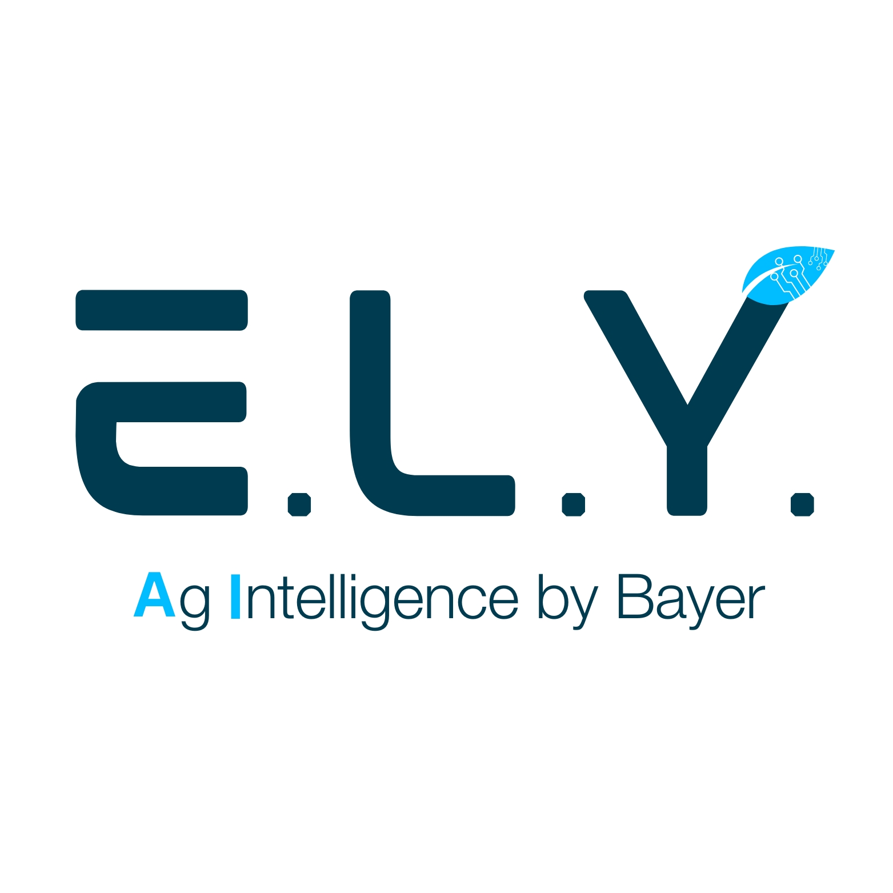
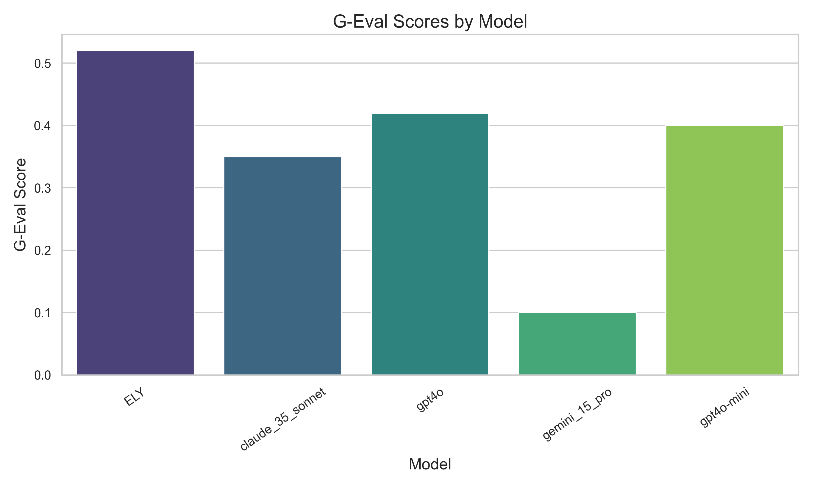

# Bayer Crop Science US Corn Crop Protection Benchmark Data Set

## Introduction

This repository is dedicated to sharing benchmarking questions related to Crop Protection for evaluating Q&A agents.

Bayer's E.L.Y. team has identified that while large language models (LLMs) are improving in general agronomy knowledge, there are still significant gaps in their understanding of specific agricultural products.

Current leading models demonstrate a broad understanding of agronomy but lack the depth required for providing high-stakes guidance on crop protection. This benchmark aims to quantify the performance differences when models are specifically trained on agricultural enterprise product portfolios.

The current benchmark focuses on the Bayer Crop Science US Corn Crop Protection Portfolio and includes a sample of 156 real-world product positioning questions. These questions reflect inquiries that farmers and channel partners might have regarding the application of Bayer’s corn crop protection products. The benchmark addresses common Crop Protection application questions related to:

- Site of action
- Application timing
- Application rate
- Common tank mixes
- Common additives
- Pests controlled

It encompasses herbicides, fungicides, and insecticides intended for use in field corn.

## QnA Construction


Answers are formatted to reflect the common output style of large language models (LLMs) compared to traditional agricultural notation. 

**Example of Agricultural Notation:**  
“0.5 oz prior to Nov 1st soil pH < 6.8 or 0.3 oz after Nov 1st pH > 6.8”

**Common LLM Output:**  
“The application rate of Autumn Super for field corn is 0.5 oz per acre if applied prior to November 1st for soils with a pH of less than 6.8, or 0.3 oz per acre if applied after November 1st for soils with a pH greater than 6.8.”

## Limitations and Restrictions on the Use of This Dataset

- This dataset is not intended for training language models or retrieval-augmented generation (RAG) solutions. **It is solely meant for validating the performance of language models or language model-based solutions.**
  
- This Q&A set should not be used for making crop protection recommendations.

- It is not permitted to crawl this dataset to train base models.

## Results

### Evaluation Methodology

Each question in the benchmark dataset was prompted with the same instruction and then evaluated using the g-eval framework [1](https://arxiv.org/pdf/2303.16634), [2](https://www.deepeval.com/docs/metrics-llm-evals). G-Eval utilizes large language models (LLMs) with chain-of-thought (CoT) reasoning to assess LLM outputs based on custom criteria. 

For our evaluation, we used the following definition, which was processed via gpt4o_mini. Our implementation returns G-Eval scores on a scale of [0, 1], where a score of 1 indicates the best match.

```python

evaluator_params = {
        "name": "Correctness",
        "criteria": "Determine whether the actual output is factually correct based on the expected output.",
        "evaluation_steps": [
            "Compare the actual output directly with the expected output to verify factual accuracy.",
            "Check if all elements mentioned in the expected output are present and correctly represented in the actual output.",
            "Assess if there are any discrepancies in details, values, or information between the actual and expected outputs.",
        ],
        "evaluation_params": [
            LLMTestCaseParams.EXPECTED_OUTPUT,
            LLMTestCaseParams.ACTUAL_OUTPUT,
        ],
    }
```


### Parameters for Model Runs

- **Prompts:** To ensure consistency, the same prompt was used for all frontier models and the ELY endpoint.

- **Parameters:** The following parameters were used for the frontier models:
  - **Max Tokens:** 4096
  - **Temperature:** 0.0

This dataset was not used in model training or ingested as as part of ELY's RAG.




## Planned Next Steps

- Our subject matter experts (SMEs) to update the benchmark annually as product portfolios and recommendations evolve.

- Expand the benchmark to include additional crops and regions, collaborating with industry partners to develop a more comprehensive suite of agricultural AI benchmarks.

- Regularly update and release results for frontier models.

- Add metadata to the Q&A dataset, with best-in-class practices for benchmarks during annual updates.

- Share Scripts used for evaluation.

## Contacts

* Balathasan Giritharan : balathasan.giritharan ~ at ~ bayer dot com
* Daniel Kurdys : daniel.kurdys ~ at ~  bayer dot com
